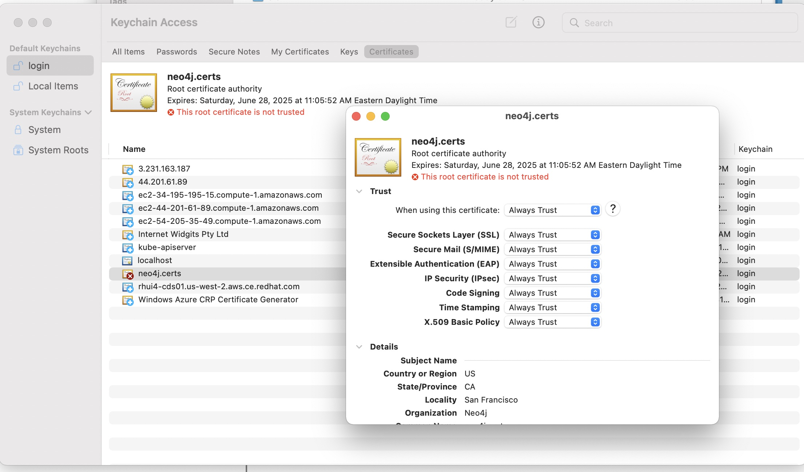

# Neo4j Projects Labs

Welcome to the Neo4j Projects Labs. Within this project is a menu-driven tool to give the user a simple way to deploy Neo4J working examples of different areas of functionality. The deployments will include steps that were taken to deploy the example, areas to study to further understand the deployment hands-on, reference documentation, and a Tips & Tricks area to cover known issues, workarounds, etc. that normally aren't documented.

Prerequiste: prior to running the labs, one will need to deploy Docker on their system, to include the docker-compose tool, which all the deployments are implemented in. For Mac's the Docker Desktop installation includes docker-compose - to enable, open the Docker Desktop UI, click on the gear icon in the top right-hand of the screen, select General, and check 'Use Docker Compose V2.'

Currently, the first and only lab availble is deploying Neo4j 4.4 with certficates. Future labs planned are: Neo4j clustering with SSR(4.4/5.X), Neo4J backup and recovery (4.4/5.X), and Neo4J Metrics integration with Prometheus/Grafana (4.4/5.X).

## Neo4J Projects Labs

Once Docker/docker-compose is running on your system, clone this project, cd to the directory, and run the following script to bring up a menu:

```./run_neo_projects.sh```

```bash
Neo4j Projects Menu

1. Start Neo4j 4.4 with certificates
2. Stop Neo4j 4.4 with certificates
3. Start Neo4j 5.x cluster (3 primaries)
4. Stop Neo4j 5.x cluster
5. Start Neo4j 5.x cluster (1 primary 1 secondary)
6. Stop Neo4j 5.x cluster
7. Check for running projects...
8. Exit
'Choose an option:' 
```

From the menu above, the user can select 2/3 to see if any projects are running and stop them (this includes projects running in docker-compose outside of this project). NOTE: this is designed only run one docker-compose project at a time.


## Neo4j 4.4 with certificates deployment example

For the certs project, if no other docker-compose projects are running (you can check by running menu items 2 &/or 3), then select menu item #1, which will deploy the project and output as follows below for the Project Steps:

```
*********************************************************************************************************

Project steps:

This project deploys neo4j with a self-signed certificate. To make this happen, the following was done:

  - A private key and self-signed server certificate were generated.

  - The needed directories were created to hold the certificates, certs copied in, and needed permissions set.
    - mkdir -p /var/lib/neo4j/certificates/bolt/trusted
    - mkdir -p /var/lib/neo4j/certificates/https/trusted

    - cp public.crt /var/lib/neo4j/certificates/bolt/trusted
    - cp public.crt /var/lib/neo4j/certificates/https/trusted
    - cp public.crt /var/lib/neo4j/certificates/bolt/
    - cp private.key /var/lib/neo4j/certificates/bolt/
    - cp public.crt /var/lib/neo4j/certificates/https/
    - cp private.key /var/lib/neo4j/certificates/https/

    - chown -R neo4j:neo4j /var/lib/neo4j/certificates
    - chmod 400 /var/lib/neo4j/certificates/bolt/private.key
    - chmod 644 /var/lib/neo4j/certificates/bolt/public.crt
    - chmod 644 /var/lib/neo4j/certificates/bolt/trusted/public.crt
    - chmod 400 /var/lib/neo4j/certificates/https/private.key
    - chmod 644 /var/lib/neo4j/certificates/https/public.crt
    - chmod 644 /var/lib/neo4j/certificates/https/trusted/public.crt

  - The neo4j.conf was updated with:
    - dbms.ssl.policy.bolt.enabled=true
    - dbms.ssl.policy.bolt.base_directory=certificates/bolt
    - dbms.ssl.policy.bolt.private_key=private.key
    - dbms.ssl.policy.bolt.public_certificate=public.crt
    - dbms.ssl.policy.bolt.trusted_dir=trusted
    - dbms.ssl.policy.bolt.client_auth=NONE

    - dbms.ssl.policy.https.enabled=true
    - dbms.ssl.policy.https.base_directory=certificates/https
    - dbms.ssl.policy.https.private_key=private.key
    - dbms.ssl.policy.https.public_certificate=public.crt
    - dbms.ssl.policy.https.trusted_dir=trusted
    - dbms.ssl.policy.https.client.auth=NONE

Items to study in this docker-compose project:

  - docker-compose.yml
  - env/base_4.4.env
  - volumes/certs/..

Docs: https://neo4j.com/docs/operations-manual/4.4/security/ssl-framework/

Tips & tricks:

  - Prior to launching in browser for first time import the server cert and root cert into your keystore (see images in readme). The certificates are found in the 'certs' directory off the root of this project: myCA.pem and public.crt. Typically, one can double-click on them and import into the keystore once prompted.
  - Certs were generated following https://ko-fi.com/post/Neo4j-and-self-signed-certificate-on-Windows-S6S2I0KQT
Issues that may come up:
  - Only provided a .pfx file. This contains both the server certificate and private key. These will need to be extracted to have them separately on disk - done via openssl commands.
  - Common browser access issues are due to not having the root and intermediate certs of the signing CA in the browser's/user's keystore. This will result in a noticeable red error in the browser URL, asking if a user want's to proceed, etc. The root and intermedite certs can be obtained a couple of ways and imported manually or via script. Once in place and trusted the cert will be recognized as legit and the browser issues will go away.

[+] Running 1/0
 ⠿ Container neo1  Running                                                                                           0.0s

Project started in docker container...
Open the Neo4j browser at --> https://localhost:7473


*********************************************************************************************************

```

Prior to opening and running in a browser, it's recommended (as per the Tips & Tricks for certs) to import the server and root certs into the keystore. Commonly, when the certs aren't in the local browser/user keystore, one will see an issue like the the following example of a Safari browser:


To remedy the browser issue, double-click on the certs/myCA.pem and certs/public.crt in the root of this project and Trust them (Mac's give a selection - different OSes vary):




